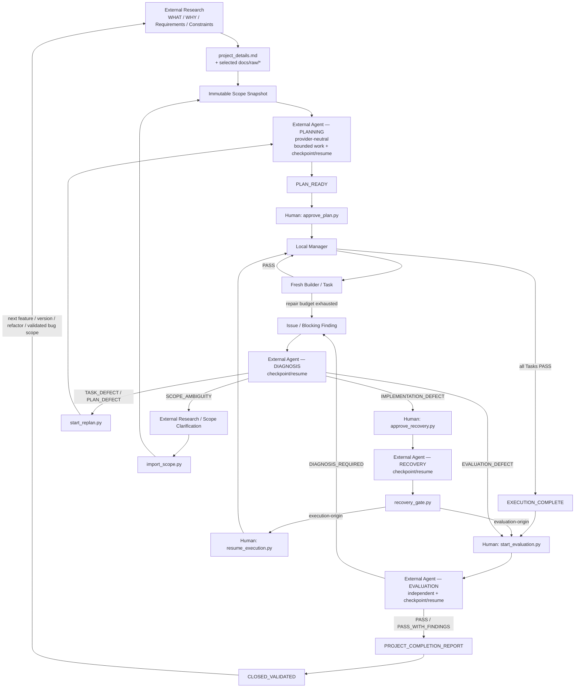

# Project Template v4.4.0
## Provider-Neutral Resumable AI Development Workflow

Project Template separates expensive reasoning, bounded implementation, and deterministic workflow authority.

> **Agents produce reasoning/work/evidence. Python grants authority. Chat history is disposable. Repository state is durable.**

## Development intent

The long-term intent, mandatory repository structure, user-mandated invariants, and maintainer expectations for **Project Template itself** are defined in [`Objective_dev.md`](Objective_dev.md). It is a maintainer/development reference, **not** user-project runtime scope and must not be treated as `EXECUTE/project_details.md`.

Anyone substantially evolving Project Template should read `VERSION` -> `Objective_dev.md` -> this README -> relevant current implementation.

---

# VERSION / CHANGE CYCLE

> **Mandatory invariant:** this diagram must always represent the current canonical workflow. Any workflow architecture change must update this diagram in the same change/version.



A validated Cycle is never reopened for new work. New scope starts a new Cycle. No approval or execution authority carries forward.

---

# 1. Responsibility model

| Layer | Responsibility | Typical tools |
|---|---|---|
| External Research | WHAT / WHY / requirements / constraints / success criteria | ChatGPT Project or other web AI |
| External Agent | expensive technical reasoning: Planning, Diagnosis, Recovery, Evaluation | Codex, Claude Code, OpenCode, Antigravity, other repository agents |
| Human | material approval boundaries | terminal/operator |
| Manager | approved Task orchestration | VS Code ProjectManager500K |
| Fresh Builder | bounded implementation of one Task | Builder100K / local or BYOK model |
| Python scripts | authority, state, gates, integrity, verification | Python 3 |

**Role != Agent != Model.** Provider identity is audit metadata, never workflow authority.

---

# 2. External Research

External Research is outside the controlled local runtime and is vendor-neutral. Use `EXECUTE/external_research/RESEARCH_GUIDE.md`. Long chats may checkpoint into external `research_workspace/` topic/source files.

Final handoff only when product/scope unknowns are zero:

```text
EXECUTE/project_details.md
EXECUTE/docs/raw/*     # only declared useful evidence
```

There is **no required `Research_Vx.md` handoff**.

Start a new Cycle with:

```bash
python scripts/start_cycle.py --title "..."
```

Python validates the mutable handoff and captures an immutable Scope Snapshot under cycle history.

---

# 3. Authoritative state

The workflow authority is:

```text
EXECUTE/control/STATE.json
```

Every transition is appended to `EXECUTE/control/TRANSITIONS.jsonl`. Markdown status files are generated views only.

External Agent resumable working memory is:

```text
EXECUTE/control/AGENT_WORK.json
EXECUTE/work/WORK_NNNN_RESUME.md
```

These are **not independent authority**. `STATE.json` contains the authoritative active-work pointer/status/sequence.

---

# 4. Provider-neutral External Agent work protocol

Planning, Diagnosis, Recovery, and Evaluation use `scripts/agent_work.py`. A fresh compatible agent with zero prior conversation history must be able to resume from the latest valid checkpoint.

Start/resume a role:

```bash
python scripts/agent_work.py begin --role PLANNING --tool "claude-code" --model "..."
python scripts/agent_work.py status
```

Checkpoint after each bounded expensive work unit:

```bash
python scripts/agent_work.py checkpoint \
  --expected-seq 0 \
  --phase REPOSITORY_RESEARCH \
  --unit RU-001 \
  --next-unit RU-002 \
  --note "Verified facts, evidence, resolved decisions, open items, exact next step"
```

Resume from another provider/session:

```bash
python scripts/agent_work.py resume --tool "codex" --model "..."
```

Complete the reasoning role before its deterministic finalizer:

```bash
python scripts/agent_work.py complete \
  --expected-seq N \
  --unit FINAL \
  --note "Durable final handoff summary"
```

The capsule stores conclusions/evidence/open items, **not hidden chain-of-thought**.

If authoritative role inputs change (Scope/Issue/Evaluation binding), the old work becomes stale rather than being silently reused. Checkpoint sequence also prevents stale sessions from overwriting newer progress. Git HEAD/dirty digest are recorded when Git is available for cross-machine/audit awareness.

---

# 5. External Agent Planning

Use:

```text
EXECUTE/external_agent/PLANNING_PROMPT.md
```

Planning researches only the repository context necessary to remove material technical uncertainty. It binds to the immutable Scope Snapshot and compiles:

```text
EXECUTE/compiled/**
EXECUTE/plan/IMPLEMENTATION_PLAN.md
EXECUTE/tasks/TASK_INDEX.md
EXECUTE/tasks/TASK_NNN.md
```

Material unknown -> `planning_gate.py hold-material-feedback` -> STOP.

Zero material unknowns -> authorize expansion. When the package is ready, Planning must complete its External Agent work item, then:

```bash
python scripts/planning_gate.py mark-plan-ready
```

`PLAN_READY` is a hard stop. Chat is feedback, never implementation approval.

---

# 6. Human implementation approval

```bash
python scripts/approve_plan.py
```

This interactive terminal gate binds approval to exact Cycle, Scope revision/digest, Planning revision, Task count, and package SHA-256.

---

# 7. Local Manager / fresh Builder — unchanged execution architecture

Manager uses `EXECUTE_PROJECT_PROMPT.md` and machine gates. It consumes only the approved immutable package and runtime state — not External Agent scratch/checkpoint history.

For each Task:

```bash
python scripts/execution_gate.py begin-task TASK_001
python scripts/context_guard.py EXECUTE/tasks/TASK_001.md
```

Manager launches one fresh bounded Builder. Builder implements only allowed scope, writes Task evidence, and verification is recorded through `execution_gate.py`.

Local repair attempts are machine-counted. Ordinary Task dispatch is one-time. Manager context is bounded by the existing batch circuit breaker (`reset_manager_batch.py`). Large command output should use `safe_exec.py`.

---

# 8. Incident -> External Agent Diagnosis

When bounded Builder repair is exhausted, `execution_gate.py fail-task` creates an Issue and pauses normal execution. Use:

```text
EXECUTE/external_agent/DIAGNOSIS_PROMPT.md
```

Diagnosis may inspect/reproduce/reason but may not repair production code. It uses resumable work checkpoints, creates immutable `Diagnosis_Vx.md`, marks DIAGNOSIS work complete, then registers exactly one classification with `diagnosis_gate.py`:

```text
IMPLEMENTATION_DEFECT
TASK_DEFECT
PLAN_DEFECT
EVALUATION_DEFECT
SCOPE_AMBIGUITY
EXTERNAL_BLOCKER
UNKNOWN
```

---

# 9. Recovery / Replan / Scope clarification

`IMPLEMENTATION_DEFECT` -> human `approve_recovery.py` -> `EXECUTE/external_agent/RECOVERY_PROMPT.md`. Recovery uses resumable checkpoints and additionally records/validates working-tree/baseline observations. Complete External Agent RECOVERY work before `recovery_gate.py`.

Execution-origin Recovery then requires human `resume_execution.py`; start a fresh Manager conversation. Evaluation-origin Recovery routes back to a separately authorized Evaluation attempt.

`TASK_DEFECT` / `PLAN_DEFECT` -> `start_replan.py` -> new Planning package -> new approval.

`SCOPE_AMBIGUITY` -> External Research clarification -> `import_scope.py` -> new immutable Scope revision -> Planning/replan as required.

---

# 10. Independent External Agent Evaluation

After all Tasks pass, human authorizes one attempt:

```bash
python scripts/start_evaluation.py
```

Use `EXECUTE/external_agent/EVALUATION_PROMPT.md`. Evaluation is independent: Planning/Manager/Builder/Recovery claims are history, not proof. It may checkpoint already verified requirement ranges/tests/findings so provider/session changes do not force repetition.

Before finalization, complete EVALUATION work, create the authorized Evaluation report, and on PASS/PASS_WITH_FINDINGS create the detailed `PROJECT_COMPLETION_REPORT_Vx.md`. Then run `finalize_evaluation.py`.

PASS closes the Cycle as `CLOSED_VALIDATED`. Blocking findings create an Evaluation-origin Issue and route to Diagnosis.

---

# 11. Next version / change cycle

The Completion Report is verified actual-system truth for the next External Research cycle. New work should begin from:

```text
latest Completion Report
+ current repository truth
+ new user goals
+ targeted new external research
```

not from old chat history.

---

# 12. Required tools

- Visual Studio Code / repository terminal
- Python 3
- Git (strongly recommended, especially for cross-machine External Agent handoff)
- any compatible External Agent provider for expensive reasoning stages
- VS Code Manager/Builder agent support and configured local/BYOK models
- optional ChatGPT Project or other Web AI for External Research

Configure local execution models with `python scripts/configure_models.py`.

---

# 13. Validation

Run:

```bash
python scripts/validate_v4.py
```

Validation checks structural invariants including `Objective_dev.md`, README reference/canonical `VERSION / CHANGE CYCLE`, provider-neutral External Agent prompts/work protocol, state schema/version, Scope/package bindings, human gates, Manager/Builder contracts, and Python compilation.

---

# 14. Compatibility paths

`EXECUTE/codex/*` remains only as deprecated v4.4.0 compatibility stubs. Canonical role prompts live under `EXECUTE/external_agent/`. This avoids silently breaking older operator habits while making provider-neutral paths authoritative.
