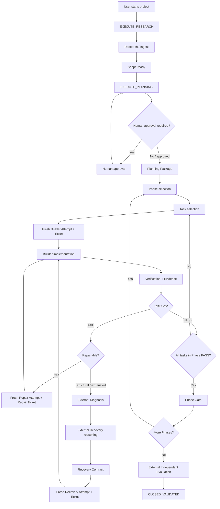
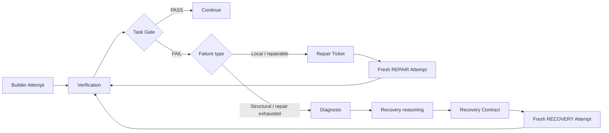

# Project Template v5.3.0

A deterministic control plane for AI-assisted software development.

Project Template separates **reasoning**, **implementation**, and **authority** so that AI models can help build software without making chat history or model claims the source of truth.

> **Core rule:** repository state is durable; chat/session/provider state is disposable.

---

## What this project does

Project Template coordinates four responsibilities:

| Component | Responsibility |
|---|---|
| **External AI** | Research, planning/architecture, escalated diagnosis, recovery reasoning, final independent evaluation |
| **ExecutionManager** | Deterministic VS Code-side routing and orchestration |
| **Builder** | Small, bounded implementation tasks using the authority in its ticket |
| **Workplan software** | State, bindings, approvals, tickets, mutation authority, gates, repair limits, recovery, integrity, resume |

Provider or model identity never grants authority by itself.

---

## Workflow at a glance



The normal user does **not** manually choose Phase IDs, Task IDs, Attempt IDs, generations, repair counters, or internal tickets. Workplan routes them deterministically.

---

## Runtime hierarchy

```text
Cycle
└── Phase
    └── Task
        └── Attempt
            ├── INITIAL
            ├── REPAIR
            └── RECOVERY
```

A Task belongs to one Phase. Every Builder dispatch creates a fresh Attempt with a durable ticket bound to the current workflow state.

If a simple plan does not define explicit phases, Workplan maps it to `PHASE_001`. Multi-phase plans use `Workplan/plan/PHASES.json` and each Task declares its `phase_id`.

---

## Normal user workflow

There are only a few commands a normal user needs most of the time:

```text
EXECUTE_RESEARCH       # External AI
EXECUTE_PLANNING       # External AI
EXECUTE_IMPLEMENTATION # VS Code / ExecutionManager
WORKPLAN_NEXT          # Ask Workplan what to do next
WORKPLAN_STATUS        # Read-only status
```

The safest operating pattern is:

```text
1. Run WORKPLAN_NEXT
2. Execute the exact command returned by Workplan
3. Complete that bounded unit of work
4. Run WORKPLAN_NEXT again
5. Repeat until CLOSED_VALIDATED
```

Do not reconstruct the next action from chat history.

---

## Exact command interface

Natural-language discussion does not grant execution authority. Public workflow authority is an **exact literal token**.

Complete public command set:

```text
WORKPLAN_STATUS
WORKPLAN_NEXT
EXECUTE_RESEARCH
EXECUTE_PLANNING
EXECUTE_IMPLEMENTATION
EXECUTE_DIAGNOSIS
EXECUTE_RECOVERY
EXECUTE_EVALUATION
RESET_PLANNING
RESET_DIAGNOSIS
RESET_RECOVERY
RESET_EVALUATION
```

External AI invocation:

```bash
python Workplan/scripts/command.py WORKPLAN_NEXT \
  --surface EXTERNAL_AI \
  --tool "<provider/tool>" \
  --model "<model>"
```

VS Code invocation:

```bash
python Workplan/scripts/command.py EXECUTE_IMPLEMENTATION \
  --surface VS_CODE \
  --tool "vscode" \
  --model "<model>"
```

If Workplan returns `REJECTED`, follow the machine reason and allowed commands.

If Workplan returns `APPROVAL_REQUIRED`, stop. Show the exact approval command to the human user. **AI must never approve itself.** After approval, resubmit the original public command.

---

## What happens during implementation

When implementation is eligible, Workplan selects the current Phase and Task and issues a fresh ticket.

A Builder ticket contains bounded authority such as:

```text
Cycle / Phase / Task / Attempt
Work ID + generation
Scope digest
Planning Package digest
Phase digest
Task digest
authorized_paths
granted read context
verification requirements
evidence requirements
```

The Builder may modify only production paths authorized by that ticket.

Example:

```text
authorized_paths:
  src/calculator.py
```

This does **not** authorize unrelated files such as:

```text
README.md
src/database.py
.github/...
```

unless those paths are present in the ticket.

---

## Task Gate and Phase Gate

A model cannot declare its own work successful.

### Task Gate

The deterministic Task Gate checks the current execution identity and evidence, including:

- current Phase / Task / Attempt / generation;
- completed Builder Work;
- ticket identity and digest;
- immutable Scope / Plan / Phase / Task bindings;
- unchanged approved Planning Package;
- declared verification results;
- required evidence;
- mutation-manifest identity;
- actual production mutations against `authorized_paths`.

Only Task Gate can mark a Task `PASS`.

### Phase Gate

A Phase cannot pass until:

- all required Tasks in that Phase are `PASS`;
- dependencies are satisfied;
- required phase-level verification/evidence passes;
- no unresolved issue affects the Phase.

Only a successful Phase Gate makes the next Phase eligible.

---

## Failure and repair flow

Routine implementation failures do not require restarting the project.



`max_repairs` defaults to `2` and may be configured from `0` through `5`.

Every repair gets a new Attempt and Repair Ticket. Old Attempts are not silently reused.

---

## Diagnosis and Recovery

External Diagnosis and External Recovery are **reasoning-only** roles.

They do not directly modify production files.

The recovery path is:

```text
Failure
  ↓
External Diagnosis
  ↓
External Recovery reasoning
  ↓
Recovery Contract
  ↓
ExecutionManager
  ↓
Recovery Ticket
  ↓
Fresh Builder Attempt
  ↓
Verification
  ↓
Task Gate
  ↓
Phase Gate
```

There is no direct "recovered = PASS" shortcut.

---

## Approval model

Human approvals are explicit and deterministic.

An approval is bound to the current state/action/subject and is:

- time-bound;
- single-use;
- invalidated by incompatible state changes;
- rotated after an incorrect challenge.

AI cannot grant its own approval.

---

## Resume and provider switching

Workplan is designed so that a chat session, model, provider, or process may disappear without becoming the source of truth.

Durable state includes:

```text
Scope
Planning Package
STATE.json
Work records
Tickets
Attempts
Evidence
Checkpoints
Bindings / digests
Recovery Contracts
```

On resume, Workplan recalculates the current bindings and compares them with the bindings captured when the Work was issued.

A mismatch blocks instead of silently rebinding.

A resumed Work receives a new generation, fencing stale sessions.

---

## Example mental model

Suppose the project is a tiny calculator:

```text
Requirement:
- add 2 3 -> 5
- sub 7 4 -> 3
- invalid operation -> non-zero exit
- tests must pass
```

Planning may produce:

```text
PHASE_001
└── TASK_001: implement src/calculator.py

PHASE_002
└── TASK_002: implement tests/test_calculator.py
```

Execution then looks like:

```text
TASK_001
  ↓
Builder writes src/calculator.py
  ↓
verification fails
  ↓
Task Gate FAIL
  ↓
Repair Attempt
  ↓
verification passes
  ↓
Task Gate PASS
  ↓
Phase Gate PASS

TASK_002
  ↓
Builder writes tests/test_calculator.py
  ↓
unit tests pass
  ↓
Task Gate PASS
  ↓
Phase Gate PASS
  ↓
External Evaluation
  ↓
CLOSED_VALIDATED
```

The important point is that the failed first Attempt is preserved as history. The repair receives fresh authority rather than pretending the failure never happened.

---

## Important repository paths

```text
Workplan/
├── ENTRY_PROMPT.md              # universal AI bootstrap / public command rules
├── Objective_dev.md             # development constitution
├── README.md                    # detailed Workplan architecture/operator guide
├── RELEASE_VALIDATION.md        # candidate validation record
├── VERSION                      # current Workplan version
│
├── control/
│   └── STATE.json               # authoritative durable runtime state
│
├── plan/                        # implementation plan / phase definitions
├── tasks/                       # task contracts
├── compiled/                    # compiled architecture/interface authority
├── work/                        # Work records, tickets, attempts, evidence
├── diagnosis/                   # durable diagnosis artifacts
├── recovery/                    # durable recovery artifacts
├── evaluation/                  # final evaluation artifacts
│
├── external_agent/              # bounded role constitutions
│
└── scripts/
    ├── command.py               # exact public command interface
    ├── status.py                # status inspection
    ├── resume.py                # durable continuation/reconciliation
    ├── integrity.py             # deterministic release manifest
    ├── validate.py              # structural/full validation
    └── _core/                   # deterministic authority mechanisms
```

---

## Validation

Run validation from the repository root.

After release files are stable, generate the deterministic manifest:

```bash
python Workplan/scripts/integrity.py generate
```

Then run the authoritative full validation:

```bash
python Workplan/scripts/validate.py --full
```

The v5.3.0 full suite covers:

```text
structural/version/schema validation
exact public command protocol
authority and invariant tests
normal multi-Phase end-to-end flow
failure + fresh Repair Attempt flow
Diagnosis / Recovery end-to-end flow
mutation authorization
resume / generation fencing
migration documentation checks
release manifest validation
```

A skipped or timed-out required suite is a validation failure.

---

## Safety / authority principles

Project Template follows a few strict invariants:

1. **Chat is not authority.** Repository state is authority.
2. **Models do not self-approve.** Human approval remains explicit.
3. **Builders receive bounded tickets.** Read context does not expand write authority.
4. **Every execution is bound.** Scope, Plan, Phase, Task, Attempt, generation, and ticket identities are checked.
5. **Failures remain visible.** Repair and Recovery create fresh Attempts.
6. **Task success is gated.** Builder claims alone cannot mark a Task `PASS`.
7. **Phase progression is gated.** The next Phase cannot start until the current Phase passes.
8. **Recovery is not a shortcut.** Recovered code returns through the normal Builder and gates.
9. **Resume fails closed on stale bindings.** Work is never silently rebound.
10. **Validation must be executable.** Do not claim release success without running the required validator.

---

## Entry points for deeper documentation

| Document | Use it for |
|---|---|
| `Workplan/ENTRY_PROMPT.md` | Exact command bootstrap for every AI surface |
| `Workplan/README.md` | Operator and control-plane architecture details |
| `Workplan/Objective_dev.md` | Required design invariants and development constitution |
| `Workplan/MIGRATION_V5_2_TO_V5_3.md` | v5.2 → v5.3 migration rules |
| `Workplan/RELEASE_VALIDATION.md` | Candidate validation procedure and recorded results |

---

## Short version

```text
Research
  ↓
Planning + human approval
  ↓
Phase
  ↓
Task
  ↓
Fresh Builder Attempt
  ↓
Verification / Evidence
  ↓
Task Gate
  ↓
Repair or Recovery when needed
  ↓
Phase Gate
  ↓
Next Phase
  ↓
External Evaluation
  ↓
CLOSED_VALIDATED
```

If you are ever unsure what should happen next:

```text
WORKPLAN_NEXT
```

Let deterministic repository state decide the continuation instead of reconstructing it from conversation history.
