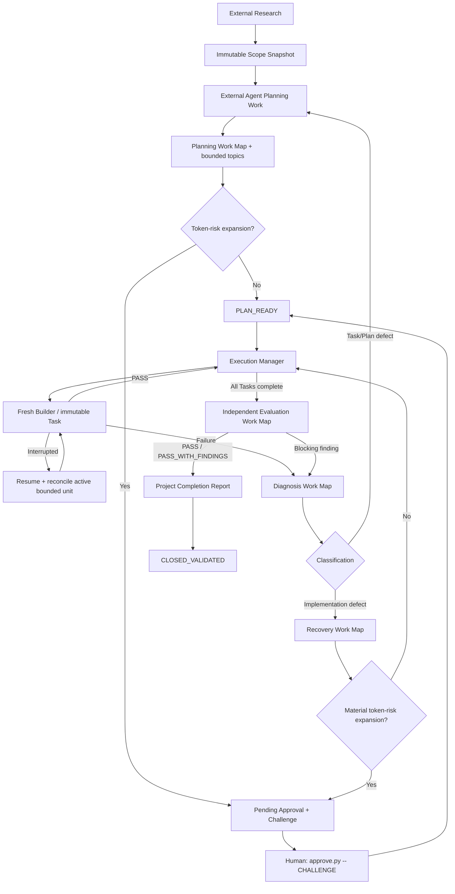

# Workplan — Project Template v5.0.0

`Workplan/` is the AI-development **control plane** for the user project. Files outside `Workplan/` are user-project space except thin platform adapters.

## Human UX

Normal users should need only:

```bash
python Workplan/scripts/resume.py
```

and, only when a material token/cost-risk boundary is pending:

```bash
python Workplan/scripts/approve.py -- <CHALLENGE>
```

The user is not required to provide Cycle IDs, digests, revisions, task counts, approval kinds, or state transitions.

## Script surfaces

- `Workplan/scripts/*.py` — stable human-facing commands.
- `Workplan/scripts/tools/*.py` — bounded deterministic AI/advanced-user commands.
- `Workplan/scripts/_core/` — internal Python implementation; do not invoke as workflow commands.

Agents must prefer tool projections over reading raw `Workplan/control/STATE.json`.

# VERSION / CHANGE CYCLE



## Universal interruption contract

Power loss, network failure, provider timeout/quota, token/context limit, editor/process crash, user Stop, provider switch, and machine transfer are treated as session interruption—not automatic workflow failure.

A fresh compatible agent must be able to run a bounded status/resume command and determine:

1. current Cycle/stage;
2. active Work/Task;
3. last durable valid checkpoint;
4. whether the working tree needs reconciliation;
5. exact next safe action;
6. whether human feedback or token-risk approval is required.

## External Agent roles

Canonical prompts live under `Workplan/external_agent/`:

- `PLANNING_PROMPT.md`
- `DIAGNOSIS_PROMPT.md`
- `RECOVERY_PROMPT.md`
- `EVALUATION_PROMPT.md`

Every role uses the same durable Work protocol. Initial work establishes a role-specific Work Map; compatible later sessions/providers resume the next bounded topic.

## Human approval

Approval is a token/cost circuit breaker, not routine bureaucracy. AI must never invoke `approve.py`.

AI obtains the pending challenge through:

```bash
python Workplan/scripts/tools/approve_req.py --id APPROVAL_0001
```

Human authorizes only by manually running:

```bash
python Workplan/scripts/approve.py -- 583194
```

AI reads the result through:

```bash
python Workplan/scripts/tools/approve_res.py --id APPROVAL_0001
```

A wrong challenge rejects that attempt, invalidates the old challenge, and rotates a new one. A challenge whose state binding is stale cannot authorize changed work.

## Work Maps

Planning map = repository research / uncertainty / decisions / package decomposition.  
Diagnosis map = reproduction / hypotheses / probes / root-cause narrowing.  
Recovery map = repair boundary / implementation / targeted and regression verification.  
Evaluation map = independent requirement/architecture/reliability/security/operability coverage.

Map refinement is allowed inside the configured envelope. Material expansion must produce a pending token-risk approval.

## Builder execution

The Manager and Builder are the bounded local execution layer. One Task is one immutable contract. Interrupted Builders resume/reconcile the active Task; they do not silently mark PASS, start another Task, or redo completed verified units.

## External Research handoff

A mandatory `Research_Vx.md` is not required. Canonical scope input is `Workplan/project_details.md` plus only declared useful `Workplan/docs/raw/*` evidence. Scope is snapshotted immutably before Planning.

## State and evidence

`Workplan/control/STATE.json` is authoritative internal state. `TRANSITIONS.jsonl` is audit history, not authority. Work maps, immutable checkpoints, approvals, evidence, scope snapshots, and package manifests are durable repository artifacts.
